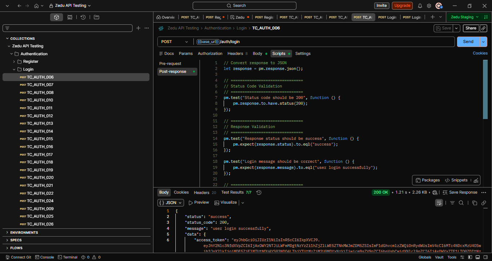
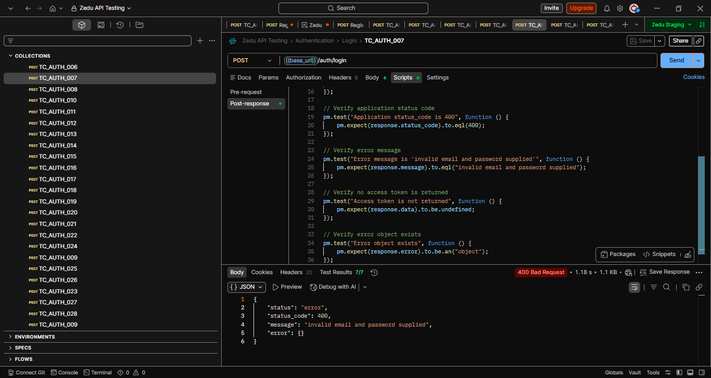
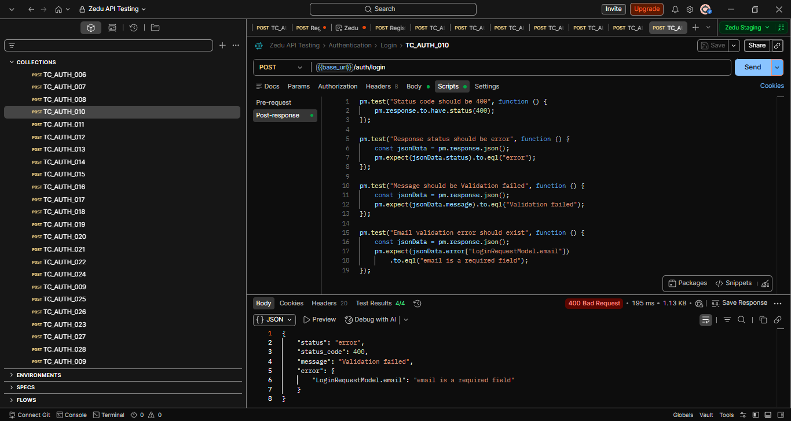

# ZEDU API Testing Portfolio


## Overview

This repository contains a comprehensive API testing project for the **ZEDU Authentication Module** using **Postman**. The project demonstrates professional Quality Assurance (QA) practices including test planning, test case design, API validation, bug reporting, and execution reporting.

The objective of this project is to verify that the Authentication APIs behave according to the API documentation (Swagger) while identifying functional defects and documentation inconsistencies.

---

# Project Objectives

* Verify Authentication API functionality
* Validate request and response payloads
* Perform positive and negative API testing
* Identify defects
* Compare actual API behavior with Swagger documentation
* Document findings using professional QA artifacts

---

# Tools Used

* Postman
* REST API
* Swagger Documentation
* Google Sheets / Microsoft Excel
* Git
* GitHub
* Visual Studio Code

---

# Technologies

* HTTP
* JSON
* REST APIs
* Bearer Authentication
* Environment Variables
* API Assertions (Postman Tests)

---

# Authentication APIs Tested

### Register

* Successful registration
* Existing phone number
* Existing email
* Missing email
* Missing password

### Login

* Successful login
* Invalid password
* Invalid email
* Invalid credentials
* Empty email
* Empty password
* Empty request body
* Invalid email format
* Leading/trailing spaces
* Whitespace password
* Very long email
* Very long password
* SQL Injection
* Cross Site Scripting (XSS)
* Uppercase email
* Unexpected request fields
* Performance testing

---

# Test Coverage

| Item                            |            Count |
| ------------------------------- | ---------------: |
| Test Scenarios                  |               28 |
| Test Cases                      |               28 |
| Bug Reports                     |                2 |
| Test Execution Report           |                1 |
| Screenshots                     |                5 |
| Authentication Endpoints Tested | Register & Login |

---

## Test Results Summary

| Result | Count |
|---------|------:|
| Passed | 12 |
| Failed | 16 |
| Total Executed | 28 |
| Pass Rate | 42.9% |
| Fail Rate | 57.1% |

Most failed tests were caused by discrepancies between the API implementation and the Swagger documentation rather than application crashes.
___

# Project Structure

```text
ZEDU-API-Testing/
│
├── Bug Reports/
├── Documentation/
├── Postman/
├── Report/
├── Screenshots/
├── Test Cases/
├── Test Scenarios/
├── README.md
└── .gitignore
```

---

# Test Artifacts

This repository contains:

* Test Scenarios
* Test Cases
* Bug Reports
* Test Execution Report
* Postman Collection
* Postman Environment
* API Response Screenshots

---

# Defects Identified

## BUG_AUTH_001

**Title**

Login API returns **HTTP 400 Bad Request** instead of the documented **HTTP 401 Unauthorized** when invalid credentials are supplied.

**Status**

Open

**Severity**

Medium

---

## BUG_AUTH_002

**Title**

Login API returns **HTTP 400 Bad Request** instead of the documented **HTTP 422 Unprocessable Entity** for validation errors.

**Status**

Open

**Severity**

Low

---

# Screenshots

## Successful Login



## Invalid Password



## Validation Error



----

# Key Findings

During testing, the following documentation mismatches were identified:

* Invalid credentials return **400** instead of the documented **401**
* Validation failures return **400** instead of the documented **422**
* Empty email returns authentication failure instead of validation failure
* Uppercase email authentication fails, indicating email comparison may be case-sensitive

---

# Sample Assertions Used

Examples of Postman assertions implemented include:

* HTTP Status Code Validation
* Response Status Validation
* Response Message Validation
* Access Token Validation
* User Object Validation
* Response Time Validation
* Error Message Validation

---

# Repository Contents

* Authentication Test Scenarios
* Authentication Test Cases
* Bug Reports
* Test Execution Report
* Postman Collection
* Environment Variables
* Supporting Screenshots

---

## Skills Demonstrated

- Manual API Testing
- REST API Validation
- Swagger Documentation Analysis
- Positive & Negative Testing
- Boundary Value Testing
- Error Handling Validation
- Security Testing (SQL Injection & XSS)
- Performance Testing
- Bug Reporting
- Test Case Design
- Test Execution
- Postman Assertions

---

# Future Improvements

The following modules will be added as the project progresses:

* Logout API Testing
* Forgot Password
* Reset Password
* Refresh Token
* Email Verification
* User Profile APIs
* Organization APIs
* Channels APIs

Future enhancements will also include:

* Dynamic Test Data
* Collection Runner
* Data-Driven Testing
* Newman CLI
* GitHub Actions
* API Automation
* Playwright UI Automation

---

# Author

**Joy Chidera Emmanuel**

Software Quality Assurance Engineer (Manual & API Testing)

Software Quality Assurance Engineer

GitHub: https://github.com/JoyEmmmanuel

LinkedIn: https://www.linkedin.com/in/joy-chidera-emmanuel-6332751a9/

Skills:

* Manual Testing
* API Testing
* Postman
* Bug Reporting
* Test Case Design
* Test Planning
* Test Execution
* REST APIs
* Git & GitHub

---

# Acknowledgements

This project was completed as part of my Software Quality Assurance learning journey to build practical experience in API testing using real-world REST APIs and industry-standard QA documentation.
